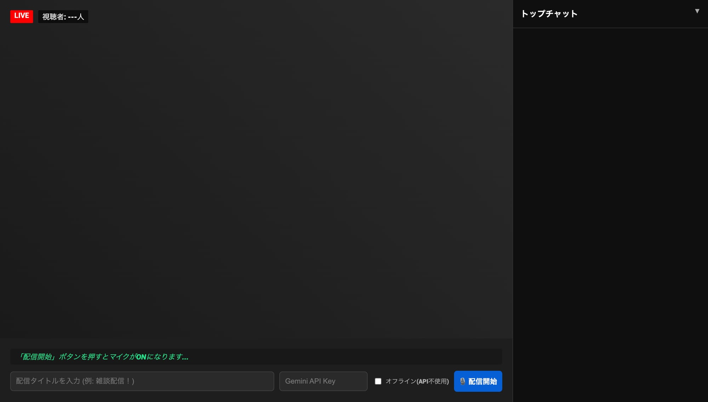

# 疑似Vtuber配信シミュレーター (Simulated Vtuber Live Stream)

一人でVtuber配信の雰囲気を楽しむための、ブラウザ完結型ライブ配信シミュレーターです。
喋った内容に対して、AI（または組み込みのロジック）がリアルタイムでリスナーコメントを生成し、熱狂的な配信画面を演出します。

## 📌 参考元
このプロジェクトは、デイリーポータルZの記事 **「[一人でライブ配信ごっこをすると、人生の空虚さが加速する](https://dailyportalz.jp/kiji/giji-live-haishin)」** にインスパイアされて作成されました。

---

## ✨ 主な機能

### 1. リアルタイム音声認識
ブラウザの **Web Speech API** を使用し、あなたの喋った声をリアルタイムで文字起こしします。

### 2. インテリジェント・リスナー・コメント
- **オンライン（AI）モード**: Gemini APIを使用し、配信タイトルや発言内容に完璧にマッチしたコメントを生成します。「初見さん」「太客」「ツッコミ役」など、個性豊かなリスナーが登場します。
- **オフラインモード**: APIキーなしでも動作。特定のキーワードに反応したり、定番のネットスラングを自動投下したりする軽量なロジックで動作します。

### 3. スーパーチャット（投げ銭）演出
YouTubeの仕様を参考にした **7色のスパチャ演出** を搭載。高額スパチャが飛ぶと画面中央にバナーが表示され、他のリスナーたちが「ナイスパ！」と盛り上げます。

### 4. 動的視聴者数
喋り続けると視聴者が増え、無言が続くと視聴者が離れていく、リアルな視聴者変動システムを搭載。

---

## 📸 画面イメージ

---

## 🛠 使い方

### 準備
1. このリポジトリをダウンロード（またはクローン）します。
2. `index.html` を Google Chrome などの最新ブラウザで開きます。

### 配信開始の手順
1. **配信タイトルを入力**: 画面下の「配信タイトルを入力」欄に、その日のテーマを入れます。
2. **モード選択**:
   - **AIで遊びたい場合**: Gemini APIキーを入力欄に貼り付けます。
   - **すぐに遊びたい場合**: 「オフライン(API不使用)」にチェックを入れます。
3. **配信開始**: 「🎙️ 配信開始」ボタンを押します。
   - ブラウザからカメラとマイクの許可を求められるので「許可」してください。
4. **喋る！**: あとはカメラに向かって喋るだけです。リスナーたちが即座に反応してくれます。

---

## ⚙️ 動作要件
- **ブラウザ**: Google Chrome / Microsoft Edge (Web Speech API 対応ブラウザ)
- **デバイス**: マイク、カメラ（カメラなしでも動作しますが、あったほうが雰囲気が出ます）
- **API（推奨）**: Google Gemini APIキー

---

## 🔒 セキュリティについて
このツールは、ユーザーが入力したAPIキーをプログラム内に保存したり、外部のサーバー（Google以外の第三者）に送信したりすることはありません。

- **APIキーの扱い**: 入力したキーはブラウザのメモリ内でのみ保持され、ページを閉じたりリロードしたりすると消去されます。
- **GitHub公開時の注意**: `index.html` のソースコードに直接APIキーを書き込まないでください。書き込んだ状態でGitHubにプッシュすると、全世界にキーが公開されてしまいます。

---

## 💡 カスタマイズ
オフラインモードの語彙を増やしたい場合は、`index.html` 内の `genericComments`（汎用コメント）や `keywordResponses`（キーワード反応）の配列を自由に編集してください。

---

*Enjoy your virtual streaming life!* 🥧🎮
